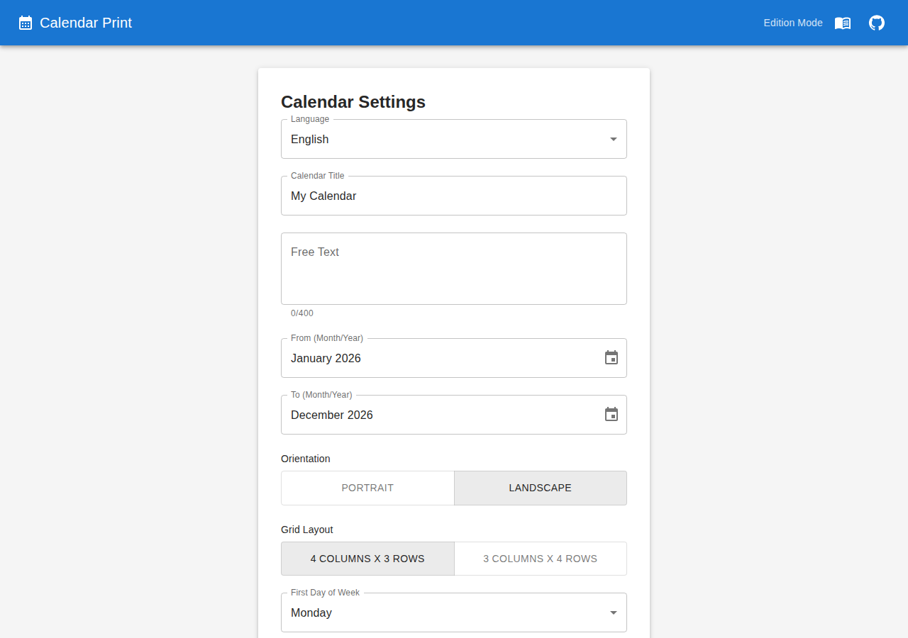
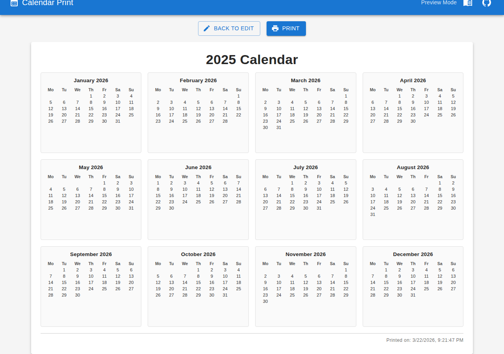

# 03 - Pages and Screen Captures

This app is a single-page React application with two functional views.

## 1) Edition Page

Description:

- Presents the calendar settings form.
- Used to define title, date range, orientation, and grid layout.

Suggested capture file:

- `docs/03-pages-and-screen-captures/01-screenshots/edition-page.png`

Example image reference (after adding the screenshot):

## 2) Preview Page

Description:

- Shows an A4 preview with all generated months.
- Includes actions to return to edition mode or print.

Suggested capture file:

- `docs/03-pages-and-screen-captures/01-screenshots/preview-page.png`

Example image reference (after adding the screenshot):

## 3) Print Result (Optional)

Description:

- Captures the rendered print output or print preview dialog result.
- Useful to verify final layout and footer timestamp visibility.

Suggested capture file:

- `docs/03-pages-and-screen-captures/01-screenshots/print-result.png`

Example image reference (after adding the screenshot):

## How To Capture

1. Run the app in development mode.
2. Open Edition Page and capture the full form.
3. Switch to Preview Page and capture the full A4 preview area.
4. Open print preview and capture the printable result (if your browser allows it).

## Screenshot Folder

For filename conventions and capture guidelines, see [01-screenshots/index.md](./01-screenshots/index.md).
